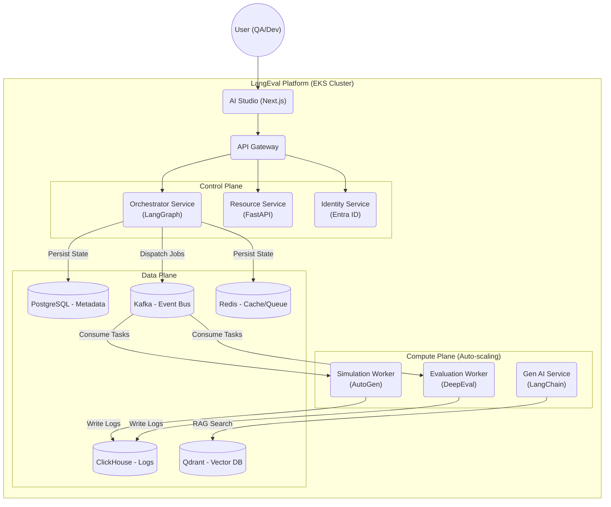

# LangEval - Enterprise AI Agent Evaluation Platform

[English](README.md) | [Tiếng Việt](README.vi.md)


[](LICENSE)
[]()
[](CONTRIBUTING.md)
[](evaluation-ui/docs)

**LangEval** is an enterprise-grade AI Agentic Evaluation Platform, pioneering the application of **Active Testing** and **User Simulation** strategies to ensure the quality, safety, and performance of Generative AI systems before they reach the market.

Unlike passive monitoring tools that only "catch errors" after an incident has occurred, LangEval allows you to proactively "attack" (Red-Teaming), stress-test, and evaluate Agents in a safe Sandbox environment.

---

## 📑 Table of Contents

1.  [Why Choose LangEval?](#-why-choose-langeval)
2.  [Core Features](#-core-features)
3.  [System Architecture](#-system-architecture)
4.  [Technology Stack](#-technology-stack)
5.  [Project Structure](#-project-structure)
6.  [Detailed Installation Guide](#-detailed-installation-guide)
7.  [Development Roadmap](#-development-roadmap)
8.  [Reference Documentation](#-reference-documentation)
9.  [Contributing](#-contributing)

---

## 💡 Why Choose LangEval?

In the era of Agentic AI, traditional evaluation methods (based on text similarity) are no longer sufficient. LangEval addresses the toughest challenges in Enterprise AI:

*   **Behavioral Evaluation (Behavioral Eval)**: Does the Agent follow business processes (SOP)? Does it call the correct Tools?
*   **Safety & Security**: Can the Agent be Jailbroken? Does it leak PII?
*   **Automation**: How to test 1000 conversation scenarios without 1000 testers?
*   **Data Privacy**: Runs entirely On-Premise/Private Cloud, without sending sensitive data externally.

---

## 🚀 Core Features

### 1. Active Testing & User Simulation 🧪
*   **Persona-based Simulation**: Automatically generates thousands of "virtual users" with different personalities (Difficult, Curious, Impatient...) using **Microsoft AutoGen**.
*   **Multi-turn Conversation**: Evaluates the ability to maintain context across multiple conversation turns, beyond simple Q&A.
*   **Dynamic Scenarios**: Flexible test scenarios supporting logical branching (Decision Tree).

### 2. DeepEval Integration & Agentic Metrics 🤖
*   **Tiered Metrics System**:
    *   *Tier 1 (Response)*: Answer Relevancy, Toxicity, Bias.
    *   *Tier 2 (RAG)*: Faithfulness (Anti-hallucination), Contextual Precision.
    *   *Tier 3 (Agentic)*: **Tool Correctness**, **Plan Adherence** (Process compliance).
*   **Custom Metrics**: Supports defining custom metrics using G-Eval (LLM-as-a-Judge).

### 3. Orchestration with LangGraph 🕸️
*   **State Machine Management**: Manages complex states of the test process.
*   **Self-Correction Loop**: Automatically detects errors and retries with different strategies (Prompt Mutation) to find Agent weaknesses.
*   **Human-in-the-loop**: Breakpoint mechanisms for human intervention and scoring when the AI is uncertain.

### 4. Enterprise Security & Compliance 🛡️
*   **Identity Management**: Pre-integrated with **Microsoft Entra ID** (Azure AD B2C) for SSO.
*   **RBAC Matrix**: Detailed permission control down to every button (Admin, Workspace Owner, AI Engineer, QA, Stakeholder).
*   **PII Masking**: Automatically hides sensitive information (Email, Phone, CC) starting from the SDK layer.

### 5. AI Studio & Comprehensive Dashboard 📊
*   **Battle Arena**: Compares A/B Testing between two Agent versions (Split View).
*   **Root Cause Analysis (RCA)**: Failure Clustering to identify where the Agent frequently fails.
*   **Trace Debugger**: Integrated Langfuse UI to trace every reasoning step (Thought/Action/Observation).

---

## 🏗️ System Architecture

LangEval adopts an **Event-Driven Microservices** architecture, optimized for deployment on Kubernetes (EKS) and horizontal scalability.



---

## 🛠️ Technology Stack

We select "Best-in-Class" technologies for each layer:

| Layer | Technology | Reason for Selection |
| :--- | :--- | :--- |
| **Frontend** | **Next.js 14**, Shadcn/UI, ReactFlow | High performance, good SEO, standard Enterprise interface. |
| **Orchestration** | **LangGraph** | Better support for Cyclic Graphs compared to traditional LangChain Chains. |
| **Simulation** | **Microsoft AutoGen** | The most powerful framework currently available for Multi-Agent Conversation. |
| **Evaluation** | **DeepEval** | Deep integration with PyTest, supporting Unit Testing for AI. |
| **Observability** | **Langfuse** (Self-hosted) | Open Source, data security, excellent Tracing interface. |
| **Database** | **PostgreSQL**, **ClickHouse**, **Qdrant** | Polyglot Persistence: The right DB for the right job (Metadata, Logs, Vectors). |
| **Queue/Stream** | **Kafka**, **Redis** | Ensures High Throughput and Low Latency for millions of events. |

---

## 📂 Project Structure

The project is organized using a Monorepo model for easy management and synchronized development:

```text
langeval/
├── backend/
│   ├── data-ingestion/      # Rust service: High-speed log processing from Kafka into ClickHouse
│   ├── evaluation-worker/   # Python service: DeepEval scoring worker
│   ├── gen-ai-service/      # Python service: Test data and Persona generation
│   ├── identity-service/    # Python service: Auth & RBAC with Entra ID
│   ├── orchestrator/        # Python service: Core logic, LangGraph State Machine
│   ├── resource-service/    # Python service: CRUD APIs (Agents, Scenarios...)
│   └── simulation-worker/   # Python service: AutoGen simulators
├── evaluation-ui/           # Frontend: Next.js Web Application
│   ├── docs/                # 📚 Detailed project documentation
│   └── ...
├── infrastructure/          # Terraform, Docker Compose, K8s manifests
└── ...
```

---

## 🚦 Detailed Installation Guide

### Prerequisites
*   **Docker & Docker Compose** (v2.20+)
*   **Python 3.10+** (pyenv recommended)
*   **Node.js 18+** (LTS)
*   **Git**

### Step 1: Clone Repository
```bash
git clone https://github.com/your-org/langeval.git
cd langeval
```

### Step 2: Initialize Infrastructure
Run the background services (Databases, Message Queue) first.
```bash
# Start PostgreSQL, Redis, Kafka, ClickHouse, Qdrant
docker-compose up -d postgres redis kafka clickhouse qdrant
```

### Step 3: Configure Environment Variables (.env)
Copy the `.env.example` file to `.env` in the root directory and each service directory.
```bash
cp .env.example .env
# Update essential keys:
# OPENAI_API_KEY=sk-...
# LANGFUSE_PUBLIC_KEY=...
# LANGFUSE_SECRET_KEY=...
```

### Step 4: Run Backend Services
You can run the entire system using Docker Compose:
```bash
docker-compose up --build
```
*Note: The first build may take 10-15 minutes to download Docker images.*

### Step 5: Access the Application
After a successful start:
*   **AI Studio (UI)**: `http://localhost:3000`
*   **API Gateway**: `http://localhost:8000`
*   **Langfuse Dashboard**: `http://localhost:3001` (Default credentials: admin/admin)

### Troubleshooting
*   **Kafka Connection Error**: Ensure the Kafka container is `healthy` before starting the workers.
*   **Port Conflict**: Check if ports 3000, 8000, 5432, 6379 are being used.

---

## 🗺️ Development Roadmap

The project is divided into 3 strategic phases:

### Phase 1: The Core Engine (Q1/2026) ✅
*   [x] Build Orchestrator Service with LangGraph.
*   [x] Integrate Simulation Worker (AutoGen) and Evaluation Worker (DeepEval).
*   [x] Complete Data Ingestion pipeline with Kafka & ClickHouse.

### Phase 2: The Studio Experience (Q2/2026) 🚧
*   [ ] Launch AI Studio with Visual Scenario Builder (Drag & Drop).
*   [ ] Integrate Active Red-Teaming (Automated Attacks).
*   [ ] Human-in-the-loop Interface (Review Queue for scoring).

### Phase 3: Scale & Ecosystem (Q3/2026+) 🔮
*   [ ] Battle Mode (Arena UI) for A/B Testing.
*   [ ] Integrate CI/CD Pipeline (GitHub Actions Quality Gate).
*   [ ] Self-Optimization (GEPA algorithm for Prompt self-correction).

---

## 📚 Reference Documentation

The comprehensive documentation system (Architecture, API, Database, Deployment) is located in the `evaluation-ui/docs/` directory. This is the Single Source of Truth.

*   **Overview**: [Master Plan](evaluation-ui/docs/00-Master-Plan.md), [Business Requirements](evaluation-ui/docs/00-Business-Requirements.md)
*   **Technical**: [System Architecture](evaluation-ui/docs/01-System-Architecture.md), [Database Design](evaluation-ui/docs/03-Database-Design.md), [API Spec](evaluation-ui/docs/04-API-Microservices-Spec.md)
*   **Operations**: [Deployment & DevOps](evaluation-ui/docs/06-Deployment-DevOps.md), [Security](evaluation-ui/docs/07-Security-Compliance.md)

---

## 🤝 Contributing

We adopt the **Vibe Coding** (AI-Assisted Development) process. Please carefully read [CONTRIBUTING.md](CONTRIBUTING.md) to understand how to use AI tools to contribute effectively and according to project standards.

---

## 📄 License

This project is licensed under the MIT License. See the [LICENSE](LICENSE) file for more details.

---
**LangEval Team** - *Empowering Enterprise AI with Confidence*
